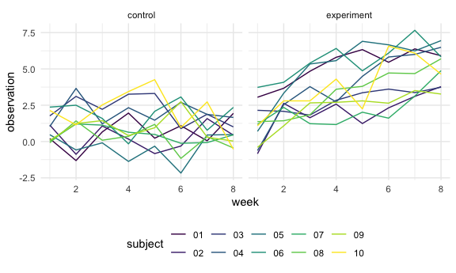

Homework 5
================
Diana Sanchez

This is my solution to HW5.

## Problem 2

Create a tidy dataframe containing data from all participants, including
the subject ID, arm, and observations over time:

``` r
files_df = 
  tibble(path = list.files("lda_data")) %>%
  mutate(
    path = str_c("lda_data/", path),
    data = map(.x = path, ~read_csv(.x))
  ) %>%
  unnest(data) %>%
    pivot_longer(
    week_1:week_8,
    names_to = "week",
    values_to = "observation"
  ) %>%
  mutate(
    arm = gsub("_[0-9]+.csv$", "", gsub("^lda_data/", "", path)),
    subject = gsub(".csv$", "", gsub("^lda_data/(con_|exp_)", "", path)),
    week = gsub("^week_", "", week)
  ) %>%
  mutate(
    arm = case_when(
      arm == "con" ~ "control",
      arm == "exp" ~ "experiment"),
    week = as.integer(week)
    ) %>%
  select(-path)


  files_df %>%
ggplot(aes(x = week, y = observation, color = subject), alpha = 0.5) + 
    geom_line() + facet_grid(.~arm)
```



Overall, the experimental group had a strong positive trend over time.
The control group, on the otherhand, had relatively stable observations
over time. In the control group, subject 10 had a strong increase from
week 2 to week 5, while in the experimental group, subject 10 had a very
strong increase between group 5 and 6.

## Problem 3

When designing an experiment or analysis, a common question is whether
it is likely that a true effect will be detected – put differently,
whether a false null hypothesis will be rejected. The probability that a
false null hypothesis is rejected is referred to as power, and it
depends on several factors, including: the sample size; the effect size;
and the error variance. In this problem, you will conduct a simulation
to explore power in a one-sample t-test.

First set the following design elements:

Fix n=30 Fix σ=5 Set μ=0 . Generate 5000 datasets from the model

x∼Normal\[μ,σ\]

For each dataset, save μ̂ and the p-value arising from a test of H:μ=0
using α=0.05 . Hint: to obtain the estimate and p-value, use broom::tidy
to clean the output of t.test.

Repeat the above for μ={1,2,3,4,5,6} , and complete the following:

Make a plot showing the proportion of times the null was rejected (the
power of the test) on the y axis and the true value of μ on the x axis.
Describe the association between effect size and power. Make a plot
showing the average estimate of μ̂ on the y axis and the true value of μ
on the x axis. Make a second plot (or overlay on the first) the average
estimate of μ̂ only in samples for which the null was rejected on the y
axis and the true value of μ on the x axis. Is the sample average of μ̂
across tests for which the null is rejected approximately equal to the
true value of μ ? Why or why not?
