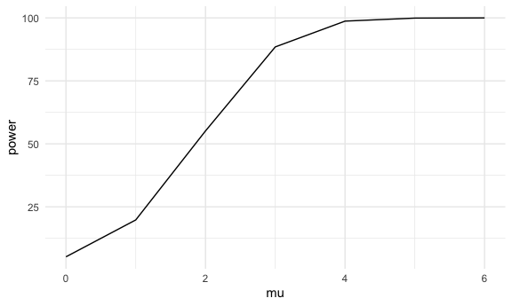
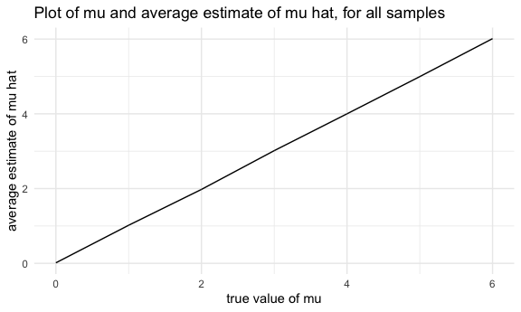
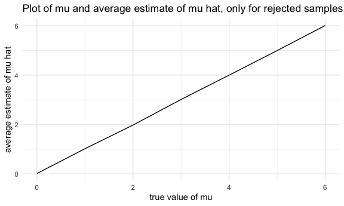

Homework 5
================
Diana Sanchez

This is my solution to HW5.

## Problem 2

Here I created a tidy dataframe containing data from all participants,
including the subject ID, arm, and observations over time, and also
graphed the data:

``` r
files_df = 
  tibble(path = list.files("lda_data")) %>%
  mutate(
    path = str_c("lda_data/", path),
    data = map(.x = path, ~read_csv(.x))
  ) %>%
  unnest(data) %>%
    pivot_longer(
    week_1:week_8,
    names_to = "week",
    values_to = "observation"
  ) %>%
  mutate(
    arm = gsub("_[0-9]+.csv$", "", gsub("^lda_data/", "", path)),
    subject = gsub(".csv$", "", gsub("^lda_data/(con_|exp_)", "", path)),
    week = gsub("^week_", "", week)
  ) %>%
  mutate(
    arm = case_when(
      arm == "con" ~ "control",
      arm == "exp" ~ "experiment"),
    week = as.integer(week)
    ) %>%
  select(-path)


files_df %>%
  ggplot(aes(x = week, y = observation, color = subject), alpha = 0.5) + 
    geom_line() + facet_grid(.~arm)
```


Overall, the experimental group had a strong positive trend over time.
The control group, on the otherhand, had relatively stable observations
over time. In the control group, subject 10 had a strong increase from
week 2 to week 5, while in the experimental group, subject 10 had a very
strong increase between group 5 and 6.

## Problem 3

``` r
fun = function(n = 30, mu = 0, sigma = 5){
  
  sim_data = tibble(
    x = rnorm(n, mean = mu, sd = sigma),
  )
  
  sim_data %>%
    t.test() %>% 
    broom::tidy() %>%
    mutate(
      mu = mu
    ) %>% 
    select(estimate, p.value, mu)

}

sample_size = 5000

output = vector("list", 50)

for (i in 1:5000) {
  output[[i]] = vector("list", 7)
  for (j in 0:6)
    output[[i]][[j + 1]] = fun(n = 30, mu = j)
}

output_df =
  output %>%
  bind_rows() %>%
  mutate(
    rejected = ifelse(p.value < 0.05, T, F)) %>%
  group_by(mu, rejected) %>%
  tally() %>%
  mutate(
    power = n / 50
  ) %>%
  filter(rejected)

output_df %>%
ggplot(aes(x = mu, y = power), alpha = 0.5) + 
    geom_line()
```


The general association is positive. In general the larger the effect
size, the stronger the power.

``` r
output_df2 =
  output %>%
  bind_rows() %>%
  mutate(
    rejected = ifelse(p.value < 0.05, T, F)) %>%
  group_by(mu) %>%
  mutate(mean = mean(estimate)) %>%
  select(mu, mean) %>%
  group_by(mu, mean)

output_df2 %>%
  ggplot(aes(x = mu, y = mean), alpha = 0.5) + 
    geom_line() + labs(title = "Plot of mu and average estimate of mu hat, for all samples",
        x = "true value of mu", y = "average estimate of mu hat")
```



``` r
output_df3 =
  output %>%
  bind_rows() %>%
  mutate(
    rejected = ifelse(p.value < 0.05, T, F)) %>%
  group_by(mu) %>%
  mutate(mean = mean(estimate)) %>%
  select(mu, mean, rejected) %>%
  filter(rejected)

output_df3 %>%
  ggplot(aes(x = mu, y = mean), alpha = 0.5) + 
    geom_line() + labs(title = "Plot of mu and average estimate of mu hat, only for rejected samples",
        x = "true value of mu", y = "average estimate of mu hat")
```



### Is the sample average of μ̂ across tests for which the null is rejected approximately equal to the true value of μ? Why or why not?

Yes, they are equal and we know this because the slope appears to be
equal to 1 on the graph.
